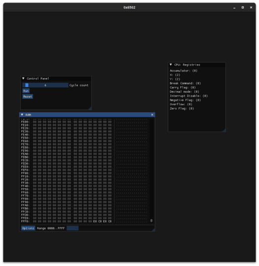

# 0x6502 Emulator
## Scope
**0x6502** is a simple 6502 emulator made for educational purposes. It features a nice GUI interface that features a RAM manipulator and a control panel (for now).




## Compiling & Running
1. Make sure you have **meson** installed.
2. Clone the project alongside its submodules: ```$ git clone --recurse-submodules https://github.com/sebiTCR/0x6502```
3. Configure the project using meson: ```meson build```
4. Compile the project: ```meson compile -C build```
5. Run the project: ```./build/basicemulator```

## Disclaimer
Since the GUI uses OpenGL, you might have issues running the emulator on MacOS. 

## FAQ
  - Is there a roadmap for the project?
  Yes, there's one and it can be found [here!](https://docs.google.com/spreadsheets/d/1S0kfK5vRL3jtGiEGcZwAOnh8Pw50EiYZSD0oXowzE6E/edit?usp=sharing)